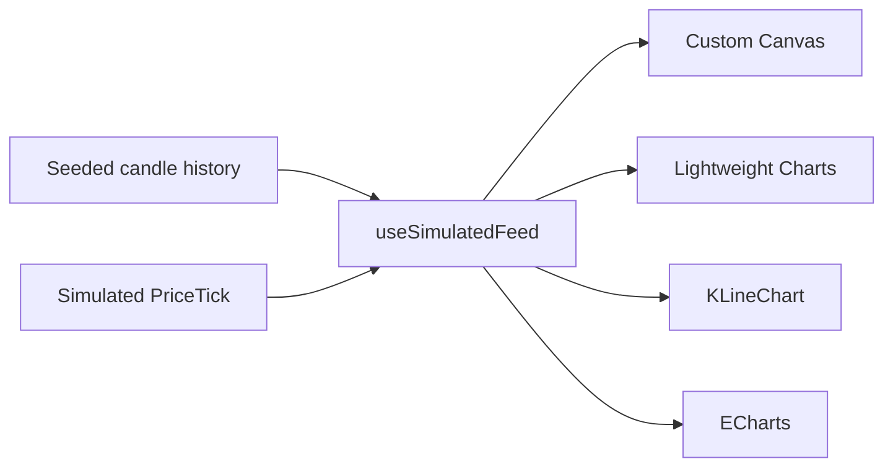
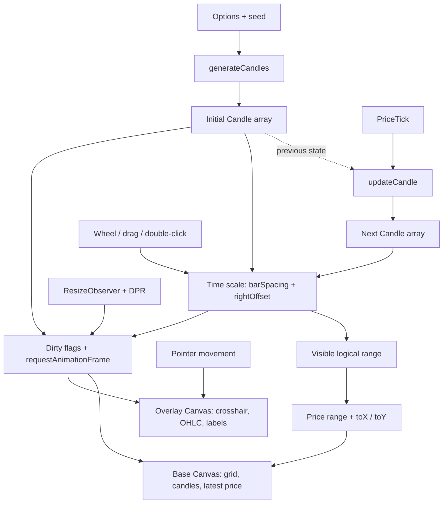

# React Candlestick Rendering Lab

[English](./README.md) · [简体中文](./README.zh-CN.md)

Four ways to render the same real-time OHLC feed in React: a custom Canvas engine, TradingView Lightweight Charts™, KLineChart, and Apache ECharts.

> This is a learning lab and engineering case study—not a charting-library benchmark. It compares architecture, integration style, interaction, and maintenance boundaries under the same demo scenario. It does not claim statistically measured performance rankings.

## Demo

> **Live demo:** Coming soon<br>
> **GIF preview:** Coming soon

An interactive deployment is the primary showcase because zooming, panning, crosshairs, period changes, and volatility modes cannot be understood from a static image alone. A short GIF will be added as a GitHub preview after deployment.

## Why this project exists

Calling a mature chart API can solve a product requirement quickly, but it hides the path from market data to pixels. Building everything from scratch exposes that path, but can also become a toy implementation with no production reference point.

This repository combines both approaches:

1. Build a focused real-time candlestick engine from first principles.
2. Refactor it from continuous repainting to layered, invalidation-driven rendering.
3. Feed the exact same candles into three mature libraries.
4. Compare what each abstraction gives you—and what it costs to maintain yourself.

The goal is not to replace mature libraries. It is to understand what they solve and make better engineering choices.

## One feed, four rendering paths



All four panels share the same Candle array and controls:

- Candle period: `1s`, `2s`, `5s`, `10s`
- Tick rate: `50ms`, `100ms`, `300ms`, `1s`
- Visible window: `10s`, `30s`, `1m`, `5m`
- Volatility profile: `Calm`, `Normal`, `Spiky`, `Chaos`
- Feed controls: start, pause, reset

Changing the candle period pauses and rebuilds the seeded history. Tick rate, visible window, and volatility changes apply to the shared feed.

## What each implementation demonstrates

| Rendering path | Implementation focus | Best fit |
| --- | --- | --- |
| **Custom Canvas** | Data-to-pixel pipeline, dual Canvas layers, invalidation, cursor-anchored zoom, drag-to-pan | Learning rendering internals and building special visual behavior |
| **Lightweight Charts** | `setData` initialization, `series.update`, built-in financial scales and crosshair | Lightweight, professional financial charts |
| **KLineChart v10** | `DataLoader`, real-time subscription, MA overlay, VOL pane | Indicator-rich trading terminals and drawing workflows |
| **ECharts** | Declarative `setOption`, linked candlestick/volume grids, `DataZoom` | Dashboards and applications with many visualization types |

These are four rendering approaches, not four competing libraries: only the first is implemented from scratch; the other three are integrations.

## The custom engine, at a glance



### Implemented in the custom version

- Seeded historical OHLC generation and deterministic reset
- Real-time updates to the current candle and period rollover
- Automatic visible price range and coordinate mapping
- Dual Canvas layers for market content and pointer interaction
- Crosshair, hovered OHLC, and latest-price line
- Cursor-anchored wheel zoom, horizontal drag, and double-click reset
- Device-pixel-ratio rendering and `ResizeObserver`
- Dirty/invalidation-driven `requestAnimationFrame`
- Strict cleanup for observers, listeners, timers, and animation frames

The drag interaction pans the logical time scale; it is not box-selection zoom. Mobile pinch zoom and inertial scrolling are deliberately outside the first version.

## Feature comparison in this demo

| Capability | Custom Canvas | Lightweight Charts | KLineChart | ECharts |
| --- | :---: | :---: | :---: | :---: |
| Real-time candle updates | ✓ | ✓ | ✓ | ✓ |
| Crosshair / tooltip | ✓ | ✓ | ✓ | ✓ |
| Zoom and historical navigation | ✓ | ✓ | ✓ | ✓ |
| Dedicated volume pane | — | — | ✓ | ✓ |
| MA overlay | — | — | ✓ | — |
| Custom data-to-pixel rendering | ✓ | — | — | — |
| General-purpose chart ecosystem | — | — | — | ✓ |

The table describes this repository's demos, not every capability supported by each upstream library.

## What this project teaches

- A tick must first be mapped into a time bucket before it can update OHLC data.
- React is a lifecycle and state boundary; it should not drive every Canvas frame.
- Chart interaction is primarily a transformation of logical range, bar spacing, and right offset.
- Separating static market content from high-frequency interaction reduces unnecessary repaint work.
- DPR, resizing, cleanup, empty states, and update granularity are part of the engine—not finishing touches.
- Mature libraries earn their value through edge cases, touch support, scale behavior, indicators, plugins, and long-term maintenance. They may provide stronger accessibility foundations, but an accessible result still depends on the integration; this demo does not claim full non-visual equivalence for its Canvas charts.

## Engineering conclusion

```text
Rendering fundamentals or unique visuals  → Custom Canvas
Lean professional financial charts        → Lightweight Charts
Indicators and trading-terminal workflows → KLineChart
Dashboards and mixed visualization types  → ECharts
```

For production work, start from product requirements rather than library popularity. A custom renderer is justified when its visual or interaction requirements are truly differentiated; otherwise, a mature library usually has the better total cost of ownership.

## Interactions

- **Start / Pause / Reset** controls the shared simulated feed.
- **Period** rebuilds deterministic history at the selected candle interval.
- **Tick rate** changes how often simulated market ticks arrive.
- **Window** changes the target visible duration.
- **Volatility** changes the simulated price behavior.
- On **Custom Canvas**, use the wheel to zoom around the pointer, drag horizontally to browse history, and double-click to restore the live view.

## Run locally

```bash
npm install
npm run dev
```

Quality checks:

```bash
npm run test:run
npm run lint
npm run build
```

## Project structure

```text
src/
├── domain/
│   ├── candles/              # Candle types, generation, tick merging
│   └── market/               # Volatility profiles
├── hooks/
│   └── useSimulatedFeed.ts   # Shared React feed lifecycle
└── features/
    ├── chart-settings/       # Shared experiment controls
    ├── custom-canvas/        # Data-to-pixel engine and dual Canvas UI
    ├── lightweight-charts/   # Lightweight Charts adapter and lifecycle
    ├── kline-chart/          # KLineChart DataLoader and indicators
    └── echarts/              # ECharts adapter, options, and DataZoom
```

## Scope and limitations

This lab intentionally does not implement a custom multi-pane engine, drawing tools, plugin system, WebGL, Workers, million-point datasets, mobile pinch gestures, or an npm package release. All four implementations are loaded together for comparison; a production application should lazy-load only the charting solution required by the current route.

## Upstream projects

- [TradingView Lightweight Charts™](https://github.com/tradingview/lightweight-charts)
- [KLineChart](https://github.com/klinecharts/KLineChart)
- [Apache ECharts](https://github.com/apache/echarts)

TradingView Lightweight Charts™ attribution is also rendered below its demo panel as required by its license notice.
