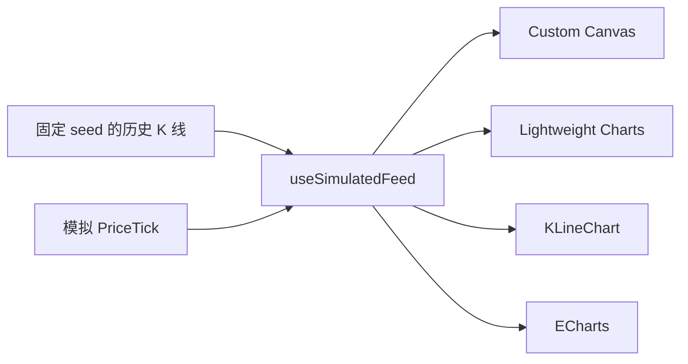
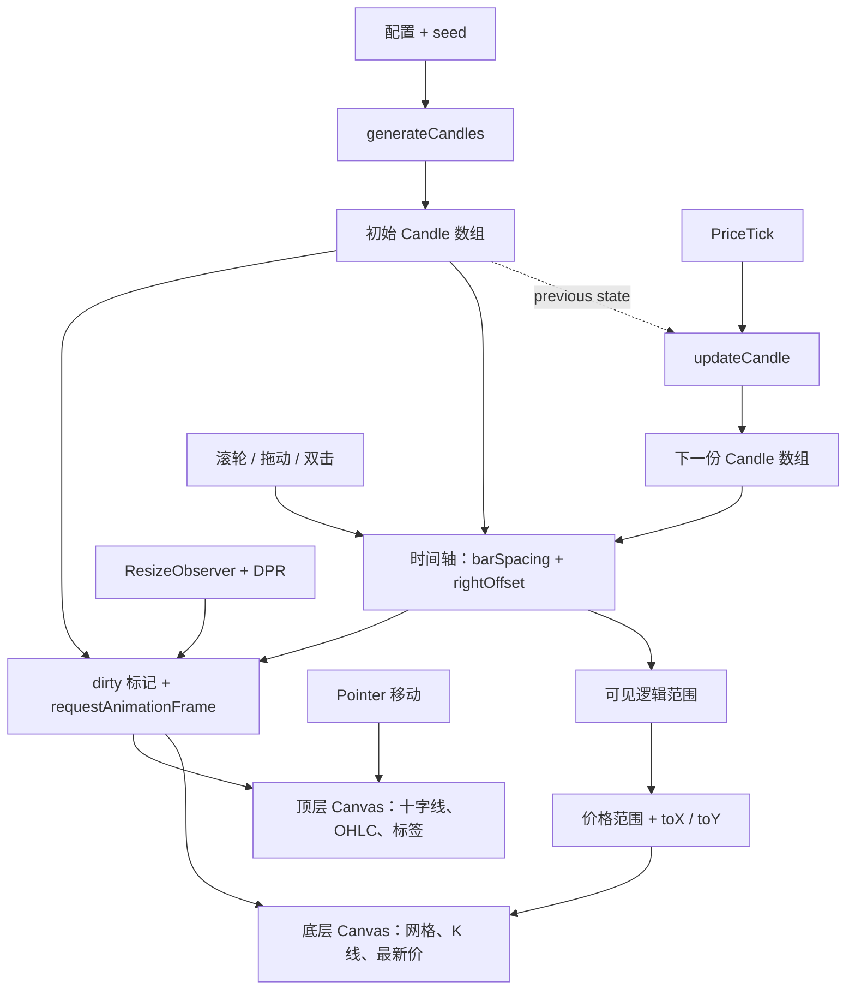

# React K 线渲染实验室

[English](./README.md) · [简体中文](./README.zh-CN.md)

使用同一份实时 OHLC 行情，对比 React 中的四种 K 线渲染路径：自研 Canvas 引擎、TradingView Lightweight Charts™、KLineChart 和 Apache ECharts。

> 这是一个学习实验仓库和工程选型案例，不是图表库性能 Benchmark。项目比较的是相同场景下的架构、接入方式、交互能力和维护边界，目前不提供经过统计测量的性能排名。

## Demo

> **在线 Demo：** 即将提供<br>
> **GIF 预览：** 即将提供

在线 Demo 是主要展示方式，因为缩放、拖动、十字线、周期切换和波动模式无法通过静态截图完整体现。部署完成后，会再增加一段简短 GIF 作为 GitHub 首屏预览。

## 为什么做这个项目

成熟图表库可以快速完成业务需求，但它会把“行情数据如何变成屏幕像素”隐藏在 API 背后。完全从零实现能够理解底层，却也容易停留在缺少生产参照的玩具版本。

这个仓库把两条路径放在一起：

1. 从零实现一个边界清晰的实时 K 线引擎。
2. 将持续全量重绘重构为分层、按需绘制。
3. 使用完全相同的 Candle 数据接入三个成熟库。
4. 对比每一层抽象提供了什么，以及自研需要承担什么维护成本。

项目的目标不是替代成熟库，而是理解成熟库解决了哪些问题，从而做出更可靠的工程选型。

## 一份行情，四种渲染路径



四张图共享同一个 Candle 数组和控制参数：

- K 线周期：`1s`、`2s`、`5s`、`10s`
- Tick 频率：`50ms`、`100ms`、`300ms`、`1s`
- 可视窗口：`10s`、`30s`、`1m`、`5m`
- 波动档位：`Calm`、`Normal`、`Spiky`、`Chaos`
- 行情控制：开始、暂停、重置

切换 K 线周期会暂停行情，并按照相同 seed 重建历史数据；Tick、窗口和波动设置直接作用于共享行情。

## 四种实现分别展示什么

| 渲染路径 | 项目中的实现重点 | 更适合的场景 |
| --- | --- | --- |
| **Custom Canvas** | 数据到像素、双 Canvas、按需绘制、锚点缩放和拖动平移 | 学习底层原理、实现特殊视觉效果 |
| **Lightweight Charts** | `setData` 初始化、`series.update`、金融坐标轴和十字线 | 轻量、专业的金融行情页面 |
| **KLineChart v10** | `DataLoader`、实时订阅、MA 覆盖层、VOL pane | 指标丰富的交易终端和画线场景 |
| **ECharts** | 声明式 `setOption`、K 线/成交量双 Grid、`DataZoom` | 后台报表和多类型业务可视化 |

这里对比的是四种渲染路径，不是四个互相竞争的图表库：只有第一种是自研引擎，另外三种是成熟库接入。

## 自研引擎实现链路



### 自研版本已经实现

- 固定 seed 的历史 OHLC 数据生成和可重复重置
- 实时更新当前 Candle，跨周期时新增 Candle
- 自动价格范围和数据到像素的坐标映射
- 行情层与交互层分离的双 Canvas
- 十字线、hover OHLC 和最新价格线
- 以鼠标位置为锚点的滚轮缩放、水平拖动和双击复位
- DPR 高清屏适配和 `ResizeObserver`
- dirty/invalidation 驱动的 `requestAnimationFrame`
- Observer、事件监听、定时器和动画帧的完整清理

当前拖动操作改变的是时间轴逻辑位置，不是框选缩放。移动端双指缩放和惯性滚动不在第一版范围内。

## 当前 Demo 功能对比

| 能力 | Custom Canvas | Lightweight Charts | KLineChart | ECharts |
| --- | :---: | :---: | :---: | :---: |
| 实时 Candle 更新 | ✓ | ✓ | ✓ | ✓ |
| 十字线 / Tooltip | ✓ | ✓ | ✓ | ✓ |
| 缩放与历史浏览 | ✓ | ✓ | ✓ | ✓ |
| 独立成交量 Pane | — | — | ✓ | ✓ |
| MA 覆盖层 | — | — | ✓ | — |
| 自定义数据到像素渲染 | ✓ | — | — | — |
| 通用图表生态 | — | — | — | ✓ |

这张表只描述当前仓库中的 Demo，不代表三个上游库的全部能力。

## 这个项目学到了什么

- tick 必须先映射到时间周期，才能正确更新 OHLC。
- React 负责状态入口和生命周期，不应该驱动 Canvas 的每一帧绘制。
- 图表缩放和平移的核心，是逻辑范围、bar spacing 和 right offset 的变化。
- 将静态行情层与高频交互层分开，可以减少不必要的重绘。
- DPR、Resize、清理、空数据和更新粒度都是引擎的一部分，而不是最后补上的细节。
- 成熟库真正的价值在于边界条件、触摸交互、坐标轴、指标、插件和长期维护。它们可能提供更成熟的无障碍基础能力，但最终结果仍取决于业务接入；当前 Demo 不宣称 Canvas 图表已经提供完整的非视觉等价体验。

## 工程选型结论

```text
理解渲染原理或特殊视觉效果  → Custom Canvas
专业轻量金融行情            → Lightweight Charts
指标和交易终端工作流        → KLineChart
后台报表和多类型可视化      → ECharts
```

生产项目应该从产品需求出发，而不是根据库的热度选型。只有当视觉或交互确实具有差异化要求时，自研渲染器才更合理；多数常规业务中，成熟库具有更低的总体维护成本。

## 页面操作

- **开始 / 暂停 / 重置**：控制共享模拟行情。
- **K 线周期**：按照所选周期重建固定历史数据。
- **Tick 频率**：改变模拟价格 tick 的到达频率。
- **可视窗口**：改变目标可视时长。
- **波动档位**：改变模拟价格的波动特征。
- 在 **Custom Canvas** 中，滚轮会以鼠标位置为锚点缩放；水平拖动可以浏览历史；双击恢复实时窗口。

## 本地运行

```bash
npm install
npm run dev
```

质量验证：

```bash
npm run test:run
npm run lint
npm run build
```

## 项目结构

```text
src/
├── domain/
│   ├── candles/              # Candle 类型、历史生成、tick 合并
│   └── market/               # 波动模式
├── hooks/
│   └── useSimulatedFeed.ts   # 共享行情的 React 生命周期
└── features/
    ├── chart-settings/       # 四张图共享的实验参数
    ├── custom-canvas/        # 数据到像素引擎和双 Canvas 页面
    ├── lightweight-charts/   # Lightweight Charts 适配与生命周期
    ├── kline-chart/          # KLineChart DataLoader 与指标
    └── echarts/              # ECharts 适配、option 和 DataZoom
```

## 范围与限制

本项目暂不实现自研多 Pane、画线工具、插件系统、WebGL、Worker、百万级数据、移动端双指手势或 npm 包发布。为了方便对比，四套方案会在同一页面加载；生产项目应当只按页面或路由懒加载真正使用的图库。

## 上游项目

- [TradingView Lightweight Charts™](https://github.com/tradingview/lightweight-charts)
- [KLineChart](https://github.com/klinecharts/KLineChart)
- [Apache ECharts](https://github.com/apache/echarts)

页面中的 Lightweight Charts Demo 下方也按照其许可证要求展示了 TradingView 归属信息。
